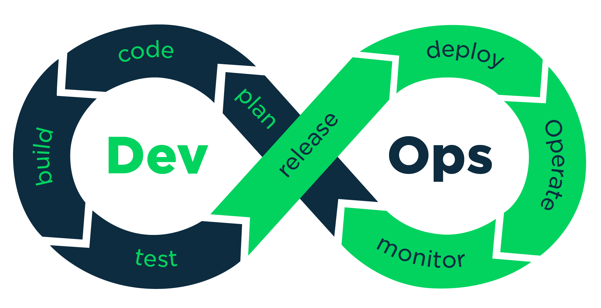

## B2 - Introduction to DevOps
####  B-DOP-200 

###  Popeye - Bootstrap 

*Eat some spinaches and become a true Docker sailor*

### Popeye - Bootstrap

#### STEP 0 – HELLO DOCKER!

> A LITTLE QUIZ TO START WITH

* Q: 
**Before starting to use Docker, it is important to gain some knowledge and to either acquire or clarify impor-tant points. Try to answer those questions with your friends**

- What is Docker?
- What is the difference between Virtual Machines and Docker containers?
- How much are 2 Docker containers separated when running on the same machine?
- What is the difference between a Docker container and a Docker image?
- In what way will spinach helps you to master DevOps?

* A: 
- Docker is a software platform that allows you to build, test, and deploy applications quickly
- VMs have the host OS and guest OS inside each VM. A guest OS can be any OS, like Linux or Windows, irrespective of the host OS. In contrast, Docker containers host on a single physical server with a host OS, which shares among them. Sharing the host OS between containers makes them light and increases the boot time.
- ?
- The key difference between a Docker image vs a container is that a Docker image is a template that defines how a container will be realized. A Docker container is a runtime instance of a Docker image.
- I don't know

#### HANDS ON THE RUDDER
